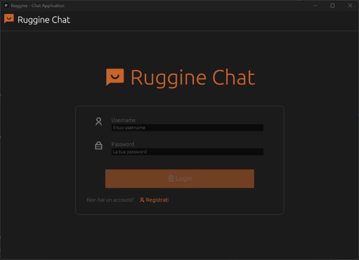
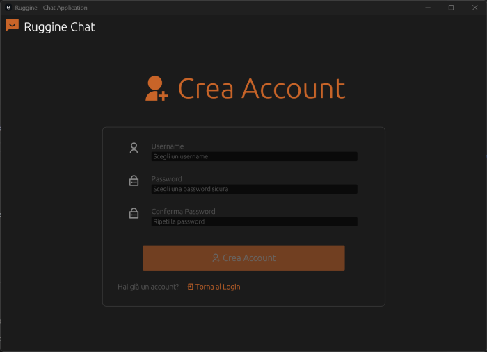
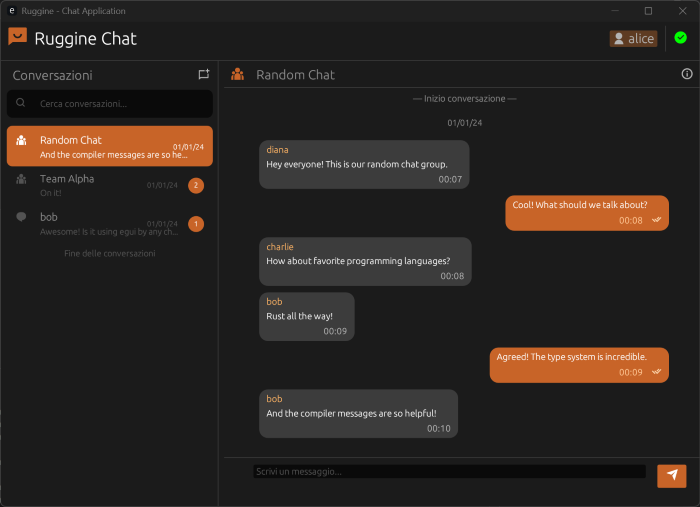
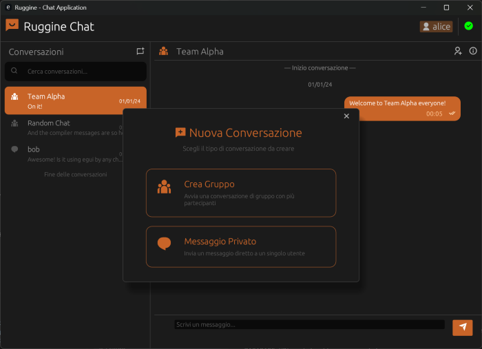
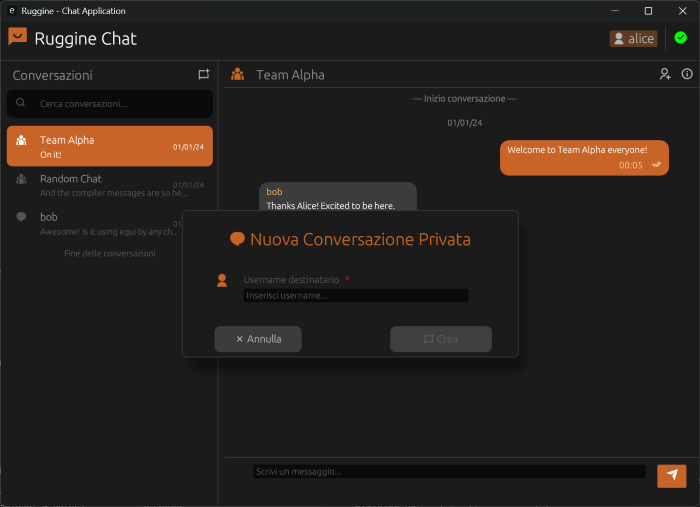
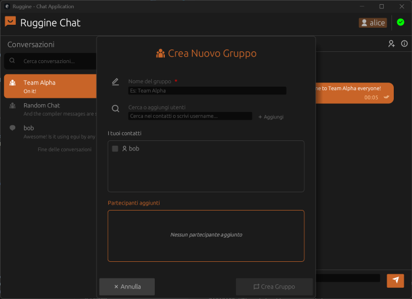
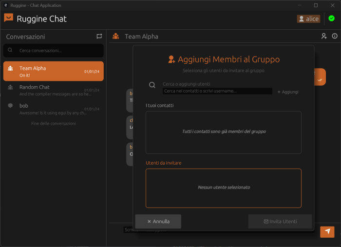
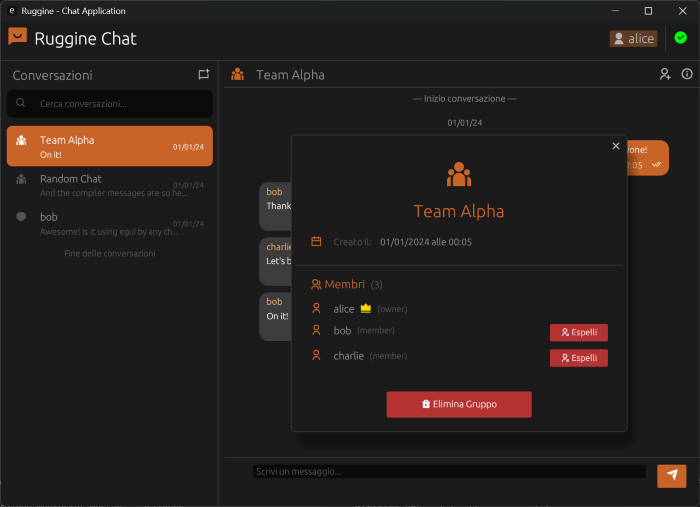
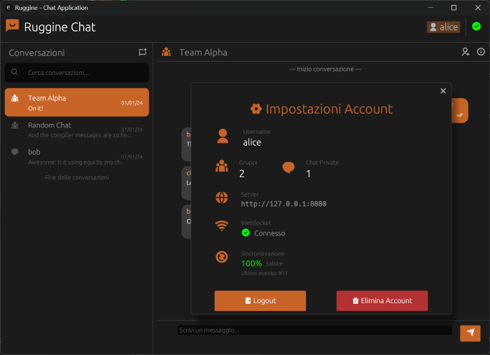

# Manuale Utente - Ruggine Chat

## Indice

1. [Introduzione](#introduzione)
2. [Requisiti di Sistema](#requisiti-di-sistema)
3. [Installazione](#installazione)
   - [Installazione del Server](#installazione-del-server)
   - [Installazione del Client](#installazione-del-client)
4. [Primo Avvio](#primo-avvio)
5. [Utilizzo dell'Applicazione](#utilizzo-dellapplicazione)
   - [Registrazione e Login](#registrazione-e-login)
   - [Interfaccia Principale](#interfaccia-principale)
   - [Messaggi Diretti (DM)](#messaggi-diretti-dm)
   - [Creazione e Gestione Gruppi](#creazione-e-gestione-gruppi)
   - [Invio Messaggi](#invio-messaggi)
   - [Gestione Account](#gestione-account)
6. [Risoluzione Problemi](#risoluzione-problemi)

---

## Introduzione

**Ruggine** è un'applicazione di messaggistica istantanea cross-platform sviluppata in Rust. Permette agli utenti di comunicare tramite messaggi diretti (DM) o gruppi privati, con sincronizzazione in tempo reale.

### Caratteristiche principali:
- **Messaggistica in tempo reale** tramite WebSocket
- **Chat dirette (DM)** tra due utenti
- **Gruppi privati** con gestione membri
- **Aggiunta membri ai gruppi** tramite ricerca contatti o username
- **Cronologia messaggi** con caricamento incrementale
- **Notifiche unread** per messaggi non letti
- **Interfaccia grafica nativa** (egui/eframe)
- **Sicurezza**: password hashate con Argon2, autenticazione JWT

---

## Requisiti di Sistema

### Server
- **Sistema Operativo**: Windows, Linux
- **RAM**: Minimo 2 GB
- **Spazio Disco**: 8,4 MB per l'applicazione + database SQLite
- **Network**: Porta 8080 disponibile (configurabile)

### Client
- **Sistema Operativo**: Windows, Linux
- **RAM**: Minimo 2 GB
- **Spazio Disco**: 11,7 MB
- **GPU**: Supporto OpenGL per rendering GUI
- **Network**: Connessione al server (default: localhost:8080)

### Software Necessario
- **Rust** (versione 1.70 o superiore)
- **Cargo** (incluso con Rust)


---

## Installazione

### Prerequisiti

1. **Installare Rust e Cargo**:

   Visitare [https://rustup.rs/](https://rustup.rs/) e seguire le istruzioni per il proprio sistema operativo.

   Verificare l'installazione:
   ```bash
   rustc --version
   cargo --version
   ```

2. **Scaricare il progetto**:

   Clonare il repository o scaricare il codice sorgente:
   ```bash
   git clone https://github.com/PdS2425-C2/G39
   cd G39
   ```

---

### Installazione del Server

1. **Navigare nella cartella del server**:
   ```bash
   cd server
   ```

2. **Configurare le variabili d'ambiente** (opzionale):

   Creare un file `.env` nella cartella `server/` con il seguente contenuto:
   ```env
   DATABASE_URL=sqlite://ruggine.sqlite
   BIND=127.0.0.1:8080
   JWT_SECRET=your-secret-key-minimum-32-characters-long
   RUST_LOG=info
   ```

   > **Nota**: Se non si crea il file `.env`, il server userà valori di default.

   > **Nota**: I valori sono **configurabili a scelta** (es. IP/porta del server tramite `BIND`, percorso DB tramite `DATABASE_URL`, livello log con `RUST_LOG`, ecc.).

3. **Compilare il server**:
   ```bash
   cargo build
   ```

4. **Avviare il server**:
   ```bash
   cargo run
   ```

   Output atteso:
   ```
   [INFO] Database initialized
   [INFO] Server listening on 127.0.0.1:8080
   ```

---

### Installazione del Client

1. **Navigare nella cartella del client** (da una nuova finestra del terminale):
   ```bash
   cd client
   ```

2. **Compilare il client**:
   ```bash
   cargo build
   ```

3. **Avviare il client**:
   ```bash
   cargo run
   ```

   Si aprirà l'interfaccia grafica dell'applicazione.

---

## Primo Avvio

### 1. Registrazione

Al primo avvio, verrà mostrata la schermata di autenticazione.



1. Cliccare sul pulsante **"Registertati"** nella parte inferiore della finestra che porterà alla schermata di registrazione.



2. Inserire un **username** (unico)
3. Inserire una **password** (minimo 4 caratteri)
4. Confermare la password
5. Cliccare su **"Crea Account"**

Se la registrazione ha successo, si viene automaticamente reindirizzati alla schermata principale dell'applicazione.

### 2. Login

1. Inserire l'**username** creato in precedenza
2. Inserire la **password**
3. Cliccare su **"Login"**

Dopo il login, l'applicazione:
- Si connette al server
- Carica le conversazioni esistenti (se presenti)
- Mostra l'interfaccia principale

---

## Utilizzo dell'Applicazione

### Interfaccia Principale

L'interfaccia è divisa in tre sezioni:

```
┌─────────────────────────────────────────────────┐
│  [Header]  Username: alice        [Account] [X] │
├──────────────┬──────────────────────────────────┤
│              │                                  │
│  [Sidebar]   │       [Chat Area]                │
│              │                                  │
│  - DM Alice  │  [Messaggi...]                   │
│  - Team Work │                                  │
│              │  ┌────────────────────────────┐  │
│  [+ New]     │  │ Scrivi messaggio...        │  │
│              │  └────────────────────────────┘  │
└──────────────┴──────────────────────────────────┘
```



1. **Header** (in alto):
   - Mostra l'username corrente
   - Pulsante **[Account]** per gestire l'account
   - Pulsante **[Logout]** per disconnettersi

2. **Sidebar** (a sinistra):
   - Elenco di tutte le conversazioni (DM e Gruppi)
   - Badge di notifica per messaggi non letti
   - Pulsante  per creare nuove chat




3. **Chat Area** (al centro):
   - Messaggi della conversazione selezionata
   - Campo di input per scrivere messaggi

---

### Messaggi Diretti (DM)

#### Creare una DM

1. Cliccare sul pulsante  nella sidebar
2. Selezionare **"Messaggio Privato"**
3. Inserire l'**username** dell'utente con cui chattare
4. Cliccare su **"Crea"**



Se la DM esiste già, verrà aperta automaticamente. Altrimenti, verrà creata una nuova conversazione.

#### Caratteristiche delle DM

- **Partecipanti**: Solo 2 utenti
- **Eliminazione**: Chiunque può eliminare la DM
- **Auto-eliminazione**: Se uno dei due utenti elimina il proprio account, la DM viene eliminata automaticamente

---

### Creazione e Gestione Gruppi

#### Creare un Gruppo

1. Cliccare su 
2. Selezionare **"Crea gruppo"**
3. Inserire un **nome** per il gruppo
4. Inserire i partecipanti tramite **"Cerca o aggiungi utenti"** oppure **"I tuoi contatti"**
4. Cliccare su **"Crea gruppo"**



Il creatore diventa automaticamente **owner** (proprietario) del gruppo.

#### Aggiungere Membri (solo Owner)

1. Aprire il gruppo nella chat area
2. Cliccare su 
3. Si aprirà una finestra con:
   - Una **barra di ricerca** per cercare tra i contatti o digitare username
   - **Elenco dei contatti disponibili** (utenti con cui hai già una DM)
   - **Sezione per utenti selezionati**
4. Cercare l'utente desiderato:
   - Digitare l'username nella barra di ricerca
   - Se l'utente è nei tuoi contatti, apparirà nell'elenco
   - Se NON è nei contatti, cliccare **"Aggiungi"** o premere **Invio** per verificare che esista
5. Selezionare uno o più utenti tramite **checkbox**
6. Cliccare su **"Invita Utenti"**



Gli utenti selezionati verranno **aggiunti immediatamente** al gruppo come **membri** (senza necessità di conferma da parte loro).

#### Rimuovere Membri (solo Owner)

1. Aprire la lista membri 
2. Cliccare su **"Espelli"** accanto al nome dell'utente da rimuovere
3. Confermare l'operazione

L'utente riceverà una notifica di espulsione.

#### Uscire da un Gruppo (solo Member)

1. Aprire il gruppo
2. Cliccare su 
3. Cliccare su **"Esci dal Gruppo"**

> **Nota**: L'owner **non può** uscire dal gruppo. Può solo eliminarlo.

#### Eliminare un Gruppo (solo Owner)

1. Aprire il gruppo
2. Cliccare su 
3. Cliccare su **"Elimina Gruppo"**

Il gruppo verrà eliminato per tutti i membri.



---

### Invio Messaggi

#### Inviare un Messaggio di Testo

1. Selezionare una conversazione dalla sidebar
2. Digitare il messaggio nel campo di input in basso
3. Premere **[Invio]** o cliccare su 

Il messaggio verrà inviato in tempo reale a tutti i partecipanti della conversazione.

#### Indicatori Visivi

- **Spinner**: Il messaggio è in fase di invio
- **Checkmark**: Il messaggio è stato confermato dal server
- **Timestamp**: Orario di invio del messaggio

#### Caricare Messaggi Precedenti

Quando si apre una conversazione, vengono caricati gli ultimi **50 messaggi**.

Per caricare messaggi più vecchi:
1. Scrollare verso l'**alto** nella chat area
2. I messaggi precedenti verranno caricati automaticamente

#### Eliminare un Messaggio

1. Cliccare con il tasto destro sul messaggio (se sei l'autore)
2. Selezionare **"Elimina"**
3. Confermare l'eliminazione

Il messaggio verrà eliminato per tutti i partecipanti.

---

### Gestione Account

#### Visualizzare Info Account

1. Cliccare sul pulsante  nell'header
2. Verrà mostrato questo pop-up:


#### Eliminare l'Account

> **ATTENZIONE**: Questa operazione è **irreversibile**.

1. Cliccare su  → **[Elimina Account]**
2. Cliccare  nuovamente per confermare **"Elimina Account"**

Quando si elimina l'account:
- **Tutte le DM** in cui si è partecipanti vengono eliminate
- **Tutti i gruppi** di cui si è owner vengono eliminati
- **I gruppi** in cui si è membri semplici rimangono (si esce automaticamente)
- **Tutti i messaggi** inviati vengono eliminati
- Gli altri utenti riceveranno notifiche appropriate

#### Logout

1. Cliccare sul pulsante **[Logout]** nell'header
2. L'applicazione si disconnette e torna alla schermata di login

---

## Risoluzione Problemi

### Errore: "Cannot connect to server"

**Causa**: Il server non è in esecuzione o l'indirizzo è errato.

**Soluzione**:
1. Verificare che il server sia avviato:
   ```bash
   cd server
   cargo run
   ```
2. Verificare che il server ascolti su `127.0.0.1:8080`
3. Controllare il firewall (se applicabile)

---

### Errore: "Invalid username or password"

**Causa**: Le credenziali inserite non sono corrette.

**Soluzione**:
1. Verificare di aver digitato username e password correttamente
2. Se non si ha un account, cliccare su **[Register]**

---

### Errore: "Username already exists"

**Causa**: Lo username scelto è già stato registrato da un altro utente.

**Soluzione**:
1. Scegliere un username diverso
2. Gli username sono case-sensitive

---

### I messaggi non vengono ricevuti in tempo reale

**Causa**: Problemi di connessione WebSocket.

**Soluzione**:
1. Verificare la connessione di rete
2. Riavviare il client
3. Verificare i log del server per errori

---

### Gap rilevati dopo disconnessione

**Causa**: Il client è stato offline e ha perso eventi.

**Soluzione**:
1. L'applicazione rileva automaticamente i gap
2. Invia richiesta di sincronizzazione al server
3. I messaggi mancanti vengono scaricati automaticamente

Se il problema persiste:
1. Chiudere e riaprire il client
2. I messaggi verranno risincronizzati

---

### L'interfaccia grafica non si apre

**Causa**: Problemi con il driver grafico o OpenGL.

**Soluzione**:
1. Aggiornare i driver della scheda grafica
2. Su Linux, installare le librerie necessarie:
   ```bash
   sudo apt-get install libxcb-render0-dev libxcb-shape0-dev libxcb-xfixes0-dev
   ```
3. Verificare che la GPU supporti OpenGL 3.0+

---

### Messaggi non confermati (spinner infinito)

**Causa**: Il server non ha confermato il messaggio.

**Soluzione**:
1. Controllare la connessione di rete
2. Verificare che il server sia raggiungibile
3. Il messaggio potrebbe essere in coda - attendere alcuni secondi
4. Se persiste, riavviare il client

---

### Non riesco a eliminare un gruppo

**Causa**: Solo l'owner può eliminare un gruppo.

**Soluzione**:
1. Verificare di essere l'owner del gruppo (controlla nella lista membri)
2. Se sei un membro semplice, usa **[Leave Group]** per uscire

---

## Contatti e Supporto

Per segnalare bug o richiedere funzionalità:
- Aprire una issue nel repository del progetto
- Consultare la documentazione tecnica

---


